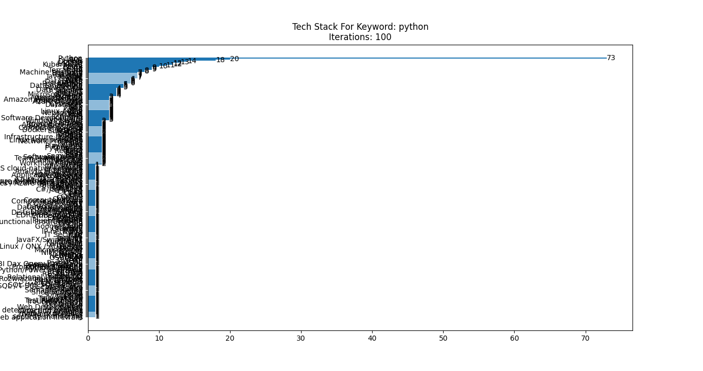
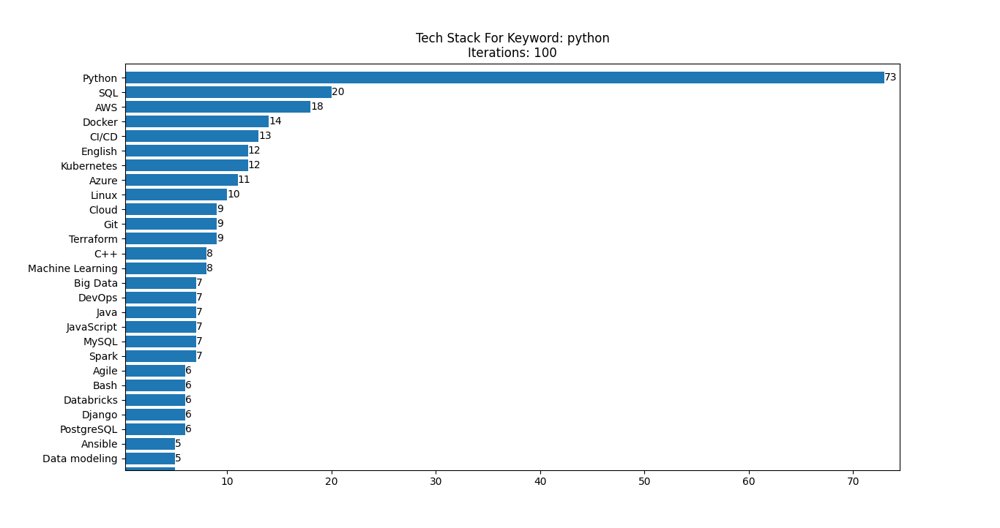

# Tech Stack Comparison Tool

A program that shows which technologies you may need to learn alongside your prefered language/technology.

1. Provide keyword(s)
2. Get technologies associated to the keyword in the job offers

## TODO:
- [ ] Restrict number of entries with occurencies under 2
- [ ] Un-hardcode variables *keyword* and *iterations*

## Usage:

1. Change these values in *main.py* to your liking:
```python
keyword = 'python'
iterations = 100
```
**WARNING:** 100 is a max value for now.

2. Zoom on a chart to make it readable:
 
 
